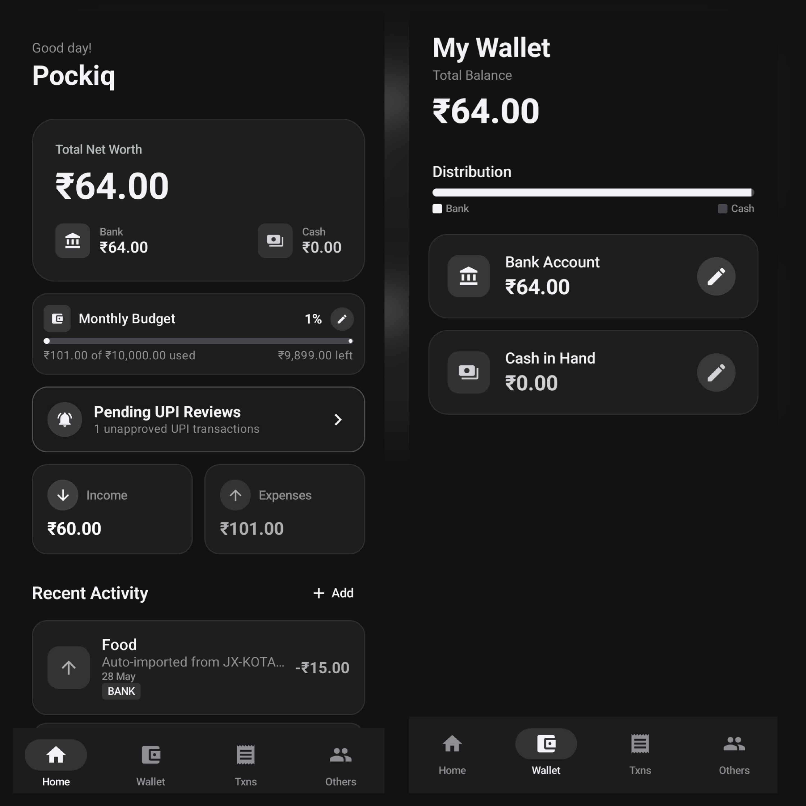
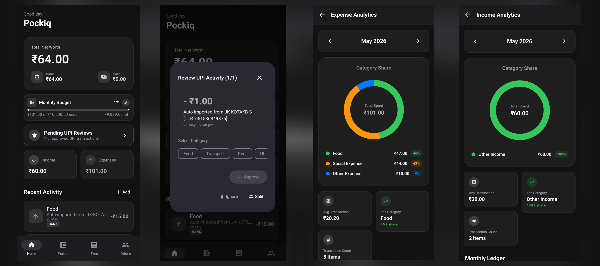
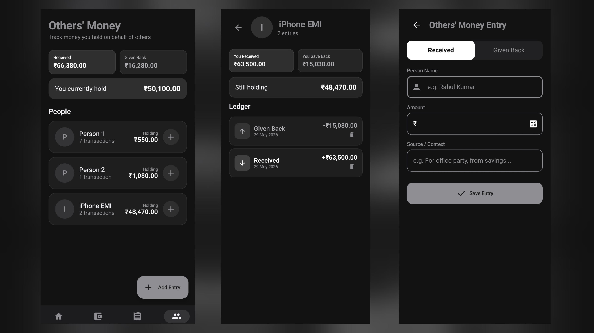
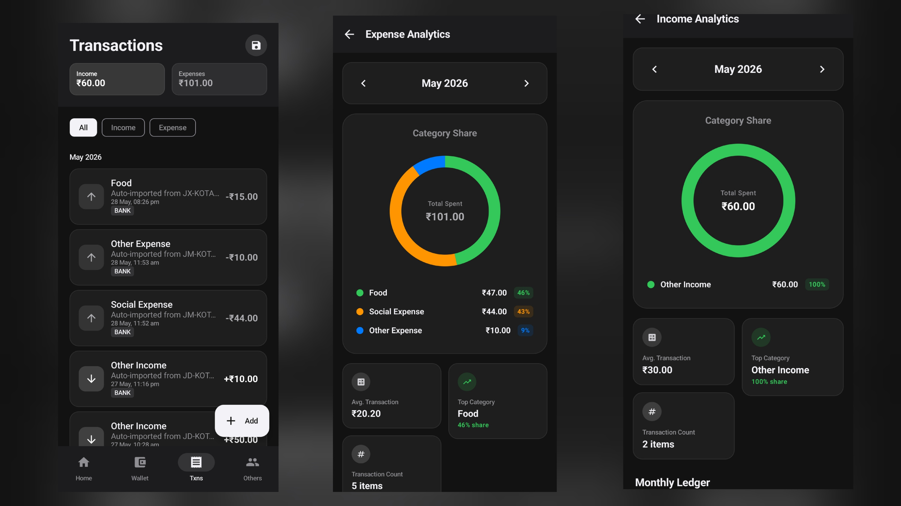

# Pockiq 💰

[](https://kotlinlang.org/)
[](https://developer.android.com/compose)
[](https://developer.android.com)
[](https://github.com/)

**Pockiq** is a smart, fully automated, and privacy-centric **personal finance tracker** for Android. It eliminates the tedious chore of manual data entry by automatically importing **UPI, credit card, and bank transaction details** directly from your system SMS alerts and payment app notifications in real-time.

Unlike other finance apps that scrape your private accounts and upload your sensitive banking data to remote cloud servers, **Pockiq is 100% offline-first**. All transaction scraping, parsing, categorization, and analytics happen exclusively on your device. 



---

## 🛡️ Privacy Policy: 100% User Ownership (No One Else Can Access Your Data)

Pockiq is built on an uncompromising privacy promise: **Your financial data belongs strictly to you, and absolutely no one else can ever access it.**

* **No Remote Servers or Backends**: Pockiq operates without any database servers, cloud API connections, or backend storage.
* **Zero Third-Party Tracking**: The application contains no analytics SDKs (such as Firebase Analytics, Mixpanel, or Flurry) or advertiser tools.
* **Complete Offline Isolation**: Your transactions, SMS fragments, and notification scrapes are stored strictly inside your device’s secure, private SQLite database.
* **Absolute local data boundaries**: Since Pockiq **has no internet access permission**, it is physically forbidden by the Android system from transmitting your files or inputs outside of your device. Not the developers, not your cellular network provider, and not any third parties can ever view or collect your transaction records.

---

## 📥 Download & Install

You can download the pre-compiled application package directly from the repository build outputs:

### [👉 Download Pockiq APK (Latest Debug Build) 👈](app/build/outputs/apk/debug/app-debug.apk)

*Alternatively, clone the repository and build the APK locally using `./gradlew assembleDebug`.*

---

## 📸 Interactive UI Showcase

### 1. Smart Dashboard & Pending Review Sheet
Pockiq never writes transactions to your finalized ledger without your consent. The **Smart Dashboard** keeps imported logs in a "Pending Review Drafts" sheet, allowing you to modify, approve, ignore, or split them before finalizing. It also displays bank/cash balances and your live monthly budget limit.



### 2. Others' Money Ledger (Splitter, Loans, EMIs & Credit Card Bills)
Need to track split bills, money lent to friends, or outstanding liabilities? The **Others' Money** screen isolates these records from your daily personal expenses. 

Beyond tracking simple debts with friends, this section acts as a powerful **Debt & Liability Tracker**. By creating manual virtual entries under dedicated names (such as "SBI Credit Card", "Car Loan", or "Home EMI"), you can easily track exactly how much you owe, log repayments, and view real-time outstanding balances. 
* **Lent / Green Balances**: Money owed to you by friends or colleagues.
* **Borrowed / Red Balances**: Money you owe to others, credit card companies, EMI providers, or banks.



### 3. Rich Analytics & Expense Composition
Get high-fidelity breakdowns of your spending patterns. View interactive charts, category percentage compositions, and searchable histories for custom date ranges.



---

## ✨ Why Pockiq? (Core Features & Automation)

* ⚡ **Seamless Auto-Import Engine**: Captures transactions instantly from live payment notifications (GPay, PhonePe, Paytm, CRED, etc.) and bank SMS alerts.
* 🛡️ **Pending Review Drafts**: Avoids cluttered records. Imported transactions remain as drafts until you verify them.
* ⚖️ **Liability & Split Ledger**: Track friend groups, split bills, or manage Credit Card Bills, active EMIs, and personal Loans in an isolated ledger system. Keeps your daily expense statistics completely separated from debts and repayments.
* 📦 **Dual Wallet Tracking**: Distinctly maintains and tracks Bank and Cash reserves with simple manual adjustment logs.
* 📊 **Dynamic Monthly Budgets**: Prominent circular progress limits warn you of overspending visually before it happens.
* 🧠 **Smart Category Ordering**: Prioritizes and auto-promotes your most frequently used categories to the front of lists, with support for creating custom category tags.
* 🏡 **Interactive Home Widget**: Quick-add buttons on your home screen for rapid manual logging.

---

## 🔒 Security Guarantees & Privacy First

We understand that accessing text messages and notifications is a major security concern. Here is how Pockiq guarantees **absolute protection** of your data:

### **🚫 The Golden Shield: ZERO Internet Permissions**
If you inspect our [AndroidManifest.xml](app/src/main/AndroidManifest.xml), you will notice that **Pockiq does not request the Android `INTERNET` permission**. 
Because it lacks internet access, the Android Operating System **physically forbids** Pockiq from communicating with any network. **It is mathematically impossible for Pockiq to transmit, leak, or upload any of your SMS contents, financial transactions, or personal data outside of your physical device.**

### Why we need these permissions:

| Permission | Why It's Needed | Security Context |
|---|---|---|
| `RECEIVE_SMS` & `READ_SMS` | Required to scrape transaction alerts from incoming bank carrier texts. | Strictly parsed locally via offline regex filters. Non-financial text messages are ignored. |
| `BIND_NOTIFICATION_LISTENER_SERVICE` | Required to read payment alerts from active notifications (GPay, Paytm, etc.). | Matches package lists. No notification data is saved or viewed unless it contains financial keywords. |
| `REQUEST_IGNORE_BATTERY_OPTIMIZATIONS` | Ensures the Android system doesn't kill the background scraping listener. | Keeps auto-import active even while your phone is asleep or under memory pressure. |

---

## 🚀 Easy Installation & Setup

To ensure auto-import functions perfectly on your Android device, follow these quick setup steps:

### 📋 Prerequisites
* Android 7.0 (API 24) or higher.
* Enabled SIM card receiving bank SMS alerts.

### ⚙️ Step-by-Step Configuration
1. **Download and Install**: Click the [Download Link](app/build/outputs/apk/debug/app-debug.apk) above and install the APK on your device.
2. **Grant SMS Access**: When launching the app for the first time, tap **Allow** when prompted for SMS permissions. This enables Pockiq to sync missed transaction alerts spanning the last 48 hours.
3. **Enable Notification Access**: 
   * Go to **Settings** $\rightarrow$ **Notification Access** (or search for *Device & App Notifications* in system settings).
   * Locate **Pockiq** in the list and toggle the permission to **Enabled**. (Required for real-time scrapes from GPay/PhonePe alerts).
4. **Bypass Battery Optimization**: 
   * When the app prompts you to disable battery optimization, tap **Allow**. 
   * This whitelists Pockiq, preventing battery management software (popular on Samsung, Xiaomi, OnePlus devices) from forcefully stopping background transaction imports.

---

## 🛠️ Project Structure & Architecture

Pockiq is designed using modern offline-first MVVM patterns under Jetpack Compose:

```
Pockiq/
├── data/
│   ├── db/               # Room entities, DAOs, AppDatabase builder
│   └── WalletRepository  # PRODUCTION CRITICAL thread-safe singleton repository layer
├── theme/                # Custom Material 3 dynamic styling & HSL palettes
├── ui/
│   ├── dashboard/        # Home screen, net worth cards, and draft review sheet
│   ├── transactions/     # Interactive transaction logs, manual adding, and graphs
│   ├── wallet/           # Cash and bank manual balancing
│   └── others/           # Lending ledger, per-person histories
├── MainActivity.kt       # Launcher, SMS permissions synchronization
├── UpiSmsReceiver.kt     # BroadcastReceiver parsing incoming bank carrier SMS
├── UpiNotificationListenerService.kt  # Notification scraping service
└── PockiqWidgetProvider.kt            # Home screen quick-add app widget
```

---

## 💻 Tech Stack

* **Language**: Kotlin 1.9+ (JVM Target 17)
* **UI**: Jetpack Compose (Material 3 components)
* **Navigation**: AndroidX Navigation 3
* **Database**: Room (SQLite) with Custom TypeConverters
* **Async/Concurrency**: Kotlin Coroutines + Flow (Thread-safe background operations)
